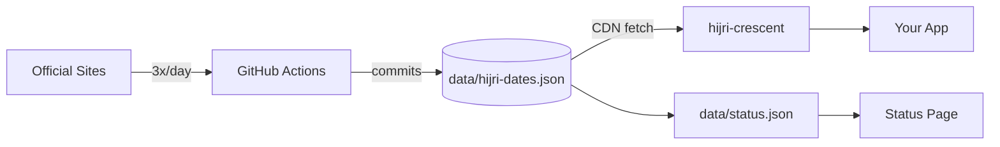

# hijri-crescent 🌙

> Today's Hijri date per country, sourced from official government and Islamic authority websites.

[](https://www.npmjs.com/package/hijri-crescent)
[](https://hijri-js.github.io/hijri-crescent)
[](https://nodejs.org)

---

## What is this?

The Islamic calendar starts each month when the crescent moon is physically sighted. **Different countries have different moon-spotters, and they don't always see it on the same night.**

Egypt might declare the start of Ramadan on Monday. Saudi Arabia on Tuesday. Both are correct for their jurisdiction.

This package returns whichever date each country's official Islamic authority published today, not a calculated estimate.

```
calendar algorithm       →   same date for all countries
this package             →   the date each country actually announced
```

---

## Why not just use a calculation?

You can predict when the moon should be visible, but Islamic jurisprudence in most countries requires physical sighting by a qualified observer. The calculated date and the announced date are often the same, but when they differ by a day, it matters: Ramadan start, Eid prayers, Hajj timing.

---

## Supported Countries

|     | Country      | Authority                                    |
| --- | ------------ | -------------------------------------------- |
| 🇪🇬  | Egypt        | Dar Al-Ifta Al-Masriyyah                     |
| 🇸🇦  | Saudi Arabia | Umm Al-Qura                                  |
| 🇦🇪  | UAE          | AWQAF (General Authority of Islamic Affairs) |
| 🇰🇼  | Kuwait       | Ministry of Awqaf and Islamic Affairs        |
| 🇯🇴  | Jordan       | Dar Al-Iftaa Al-Urduniyyah                   |

[Status page](https://hijri-js.github.io/hijri-crescent)

---

## Installation

```bash
npm install hijri-crescent
# or
pnpm add hijri-crescent
```

Requires Node.js 20+.

---

## Usage

```typescript
import { getHijriDateByCountry } from "hijri-crescent";

const result = await getHijriDateByCountry({ country: "Egypt" });

if (result.success) {
  console.log(result.data.date, result.data.month, result.data.year);
  console.log(result.source); // the official website
  console.log(result.cachedAt); // when it was scraped
} else {
  console.error(result.code, result.error);
}
```

Accepts full names or 2-letter codes, case-insensitive:

```typescript
getHijriDateByCountry({ country: "Egypt" });
getHijriDateByCountry({ country: "egypt" });
getHijriDateByCountry({ country: "EG" });
getHijriDateByCountry({ country: "eg" });
```

### Types

```typescript
import type {
  HijriDateResult,
  HijriDateData,
  CountryCode,
} from "hijri-crescent";

const result: HijriDateResult = await getHijriDateByCountry({
  country: "Kuwait",
});

if (result.success) {
  const { date, month, year }: HijriDateData = result.data;
}
```

---

## Error codes

| Code                    | When                                                      |
| ----------------------- | --------------------------------------------------------- |
| `COUNTRY_NOT_SUPPORTED` | Country name or code not recognized                       |
| `FETCH_FAILED`          | Could not reach the CDN, or cached data is older than 36h |
| `PARSE_FAILED`          | Scraper ran but got bad data from the official site       |

---

## How it works

A GitHub Actions workflow runs 3x per day, scrapes each official site, and commits the results to `data/hijri-dates.json` in this repo. The package fetches that file from GitHub's CDN.



Cached data is valid for 36 hours. Scrapes run at 00:00, 12:00, and 18:00 UTC to catch date changes around local sunset.

---

## Status page

**[hijri-js.github.io/hijri-crescent](https://hijri-js.github.io/hijri-crescent)**

Shows the last scrape time and success/error state for each country.

---

## Contributing

### Fixing a broken scraper

1. `git clone` + `pnpm install`
2. `pnpm exec playwright install chromium`
3. Edit `scripts/scrapers/XX.ts`
4. Run `pnpm scrape` and verify `data/hijri-dates.json`
5. Open a PR

### Adding a country

1. Add `scripts/scrapers/XX.ts`
2. Register it in `scripts/websites.ts` and `scripts/scrape.ts`
3. Add it to `src/lib/lookup.ts` and the `CountryCode` type in `src/types.ts`
4. Add tests and update the table above

---

## License

MIT © [Khaled Taymour](https://github.com/KhaledTaymour)
